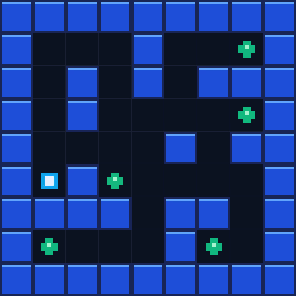
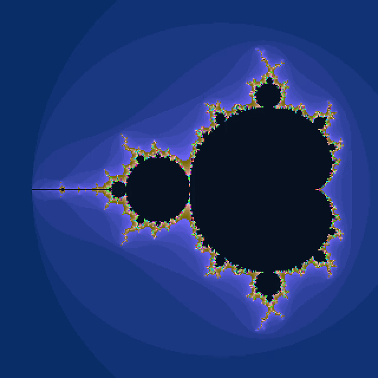

<div align="center">

# SDL2 Visual Explorer

### A C23 SDL2 project for a grid-based maze game and a deterministic Mandelbrot explorer.

[](https://github.com/ReverseZoom2151/sdl2-visual-explorer/actions/workflows/ci.yml)

</div>

SDL2 Visual Explorer brings two interactive programs together on a common, well-tested C foundation. The maze is driven by a validated ASCII level and a graphics-independent game core; the fractal explorer exposes deterministic, user-controlled navigation and colour rendering. SDL2 is limited to the display boundary, so the logic can be tested without opening a window.

## Run it

```bash
git clone https://github.com/ReverseZoom2151/sdl2-visual-explorer.git
cd sdl2-visual-explorer
sudo apt-get install -y cmake ninja-build libsdl2-dev
cmake --preset dev
cmake --build --preset dev
ctest --test-dir build/dev --output-on-failure
```

```bash
./build/dev/maze-explorer
./build/dev/fractal-explorer
```

## 1. Emerald Maze

`maze-explorer` is a small grid game: collect every emerald while navigating a wall-bounded level. The application renders the model, but does not own it. `src/core/level.c` validates each ASCII level before creating entities: rows must match the grid width, only known tiles are accepted, and exactly one player is required.

<p align="center">
  
</p>

The animation is a direct capture of the compiled SDL program running its current level, not a separate illustration.

| Control | Action |
| --- | --- |
| Arrow keys | Move the player |
| `Esc` | Quit |

The core handles movement, walls, collectibles, state transitions, and safe out-of-bounds rejection. It has no SDL dependency.

## 2. Mandelbrot Flight

`fractal-explorer` renders a deterministic view of the Mandelbrot set. Its mapping, escape-time iteration, zooming, and panning live in the tested core layer; the application only turns iterations into pixels.

<p align="center">
  
</p>

This is likewise captured from the SDL application as it receives real keyboard zoom and pan events.

```c
fractalView view = defaultFractalView();
zoomFractal(&view, 0.75);     // zoom in
panFractal(&view, -0.15, 0);  // pan left by a fraction of the current scale
```

| Control | Action |
| --- | --- |
| `Z` / `X` | Zoom in / out |
| Arrow keys | Pan |
| `Esc` | Quit |

## Command reference

| Command | Purpose |
| --- | --- |
| `cmake --preset dev` | Configure a debug build with CTest enabled |
| `cmake --build --preset dev` | Build both explorers and core tests |
| `ctest --test-dir build/dev --output-on-failure` | Run the core regression suite |
| `make build` / `make test` | Convenience wrappers for the development preset |
| `make sanitize` | Build and test with AddressSanitizer and UBSan |
| `cmake --build build/dev --target format-check` | Check C formatting without changing files |

## Project layout

```text
app/                 maintained SDL applications
examples/            small SDL reference programs
include/emerald/     public C interfaces
src/core/            tested, SDL-independent game and fractal logic
src/platform/        SDL2 display adapter
tests/               CTest regression coverage
docs/                architecture notes
```

```text
maze-explorer ───────┐
fractal-explorer ────┼──> emerald_core (no graphics dependency)
                     └──> emerald_display ──> SDL2
```

## Quality bar

The project is checked on every push and pull request with:

- `clang-format` in verification mode;
- CMake/Ninja builds with strict compiler warnings;
- CTest regression tests;
- Valgrind on the graphics-independent core; and
- AddressSanitizer plus UndefinedBehaviorSanitizer.

Locally, run the core memory check with:

```bash
valgrind --error-exitcode=1 --leak-check=full build/dev/emerald-core-tests
```

## Design notes

The project deliberately chooses a small API surface over a framework. The level loader is reusable without SDL, fractal operations are pure numerical functions over `fractalView`, and the display adapter owns SDL lifecycle and input translation. See [`docs/ARCHITECTURE.md`](docs/ARCHITECTURE.md) for the component boundaries.
